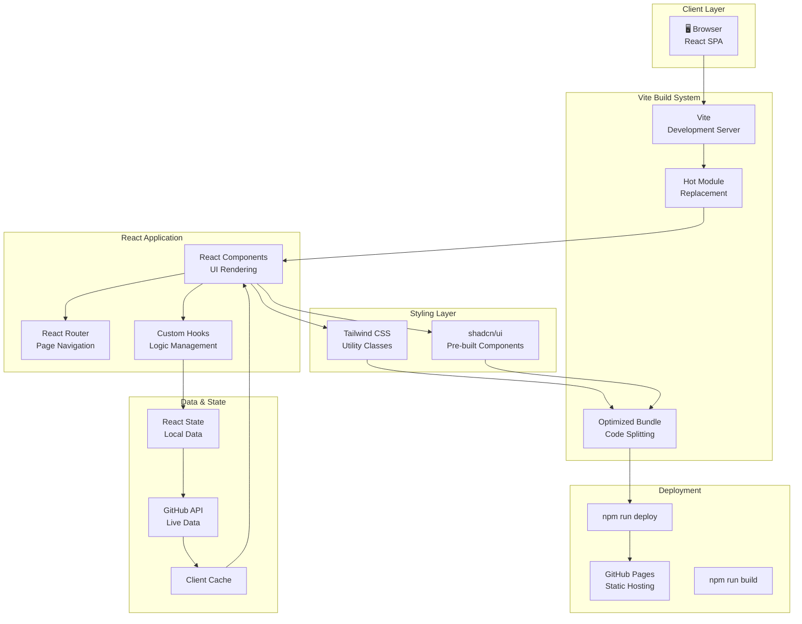
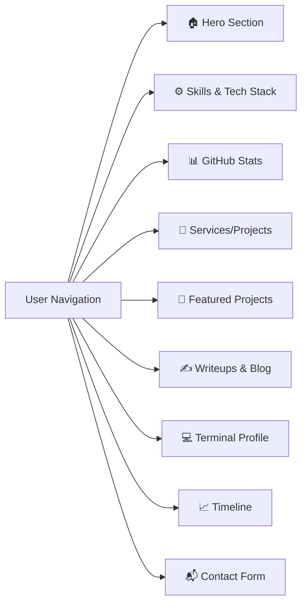

# Portfolio - Architecture Overview

## System Architecture



## Page Architecture



## Tech Stack

| Layer | Technologies |
|-------|--------------|
| **Build Tool** | Vite |
| **Framework** | React 18 |
| **Language** | TypeScript (86.6%) |
| **Styling** | Tailwind CSS (10.1%) |
| **Components** | shadcn/ui |
| **API Integration** | GitHub REST API |
| **Hosting** | GitHub Pages |
| **Package Manager** | npm |

## Project Structure

```
portfolio/
├── src/
│   ├── components/
│   │   ├── sections/
│   │   │   ├── Hero.tsx              # Landing hero section
│   │   │   ├── Skills.tsx            # Tech stack display
│   │   │   ├── Stats.tsx             # GitHub stats integration
│   │   │   ├── Services.tsx          # Services offered
│   │   │   ├── Projects.tsx          # Featured projects
│   │   │   ├── Writeups.tsx          # Blog/writeups
│   │   │   ├── Terminal.tsx          # Terminal aesthetic
│   │   │   ├── Timeline.tsx          # Experience timeline
│   │   │   └── Contact.tsx           # Contact form
│   │   ├── ui/
│   │   │   └── [shadcn components]   # Pre-built UI
│   │   └── layout/
│   │       ├── Header.tsx            # Navigation
│   │       └── Footer.tsx            # Footer
│   ├── hooks/
│   │   ├── useGitHubAPI.ts          # GitHub API integration
│   │   └── [custom hooks]
│   ├── lib/
│   │   ├── github.ts                 # GitHub API utilities
│   │   └── utils.ts                  # Helper functions
│   ├── styles/
│   │   ├── globals.css              # Global styles
│   │   └── tailwind.css             # Tailwind directives
│   ├── App.tsx                       # Root component
│   └── main.tsx                      # Entry point
├── public/
│   ├── assets/                       # Static assets
│   └── images/                       # Portfolio images
├── dist/                             # Build output
├── vite.config.ts                    # Vite configuration
├── tsconfig.json                     # TypeScript config
├── tailwind.config.js                # Tailwind config
└── package.json
```

## GitHub API Integration

```
Components
    ↓
useGitHubAPI Hook
    ↓
GitHub REST API
    ↓
Cache (localStorage)
    ↓
Render Stats/Data
```

## Data Flow

1. **User loads page** → Vite serves optimized bundle
2. **Components mount** → useGitHubAPI hook fetches GitHub data
3. **Data cached** → Stored in localStorage for performance
4. **Components render** → Display fetched data with Tailwind styling
5. **User navigates** → React Router handles client-side routing
6. **HMR active** → Instant updates during development

## Build & Deployment

```
npm run dev
    ↓
Vite dev server (localhost:3000)
    ↓
npm run build
    ↓
Vite bundles & optimizes
    ↓
dist/ folder created
    ↓
npm run deploy
    ↓
GitHub Pages deployment
    ↓
harrydev.one/portfolio
```

## Key Features

- ✅ **Live GitHub Integration** - Real-time stats from GitHub API
- ✅ **Bento Grid Layout** - Modern, responsive design
- ✅ **Dark Terminal Aesthetic** - Custom theme matching personal brand
- ✅ **Mobile Responsive** - Works on all screen sizes
- ✅ **Fast Performance** - Vite optimizations + code splitting
- ✅ **Type Safe** - Full TypeScript coverage
- ✅ **Accessible** - shadcn/ui ensures WCAG compliance

## Performance Optimizations

- Code splitting per route
- Lazy loading of images
- CSS purging with Tailwind
- Minified production builds
- Gzip compression
- CDN distribution via GitHub Pages

---

*Last Updated: 2026-07-13*
